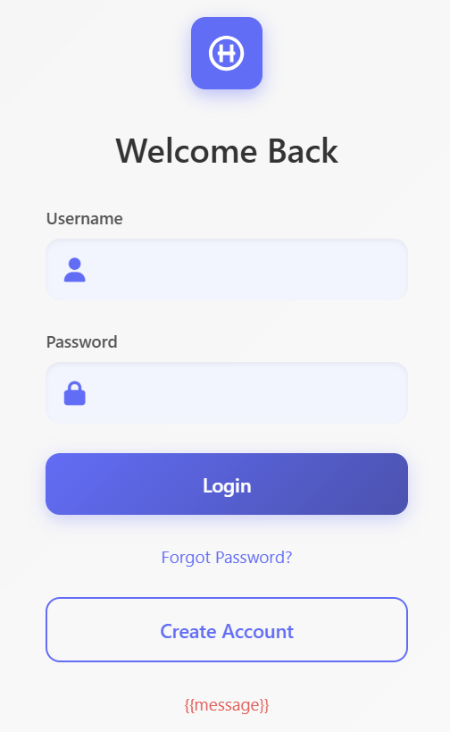
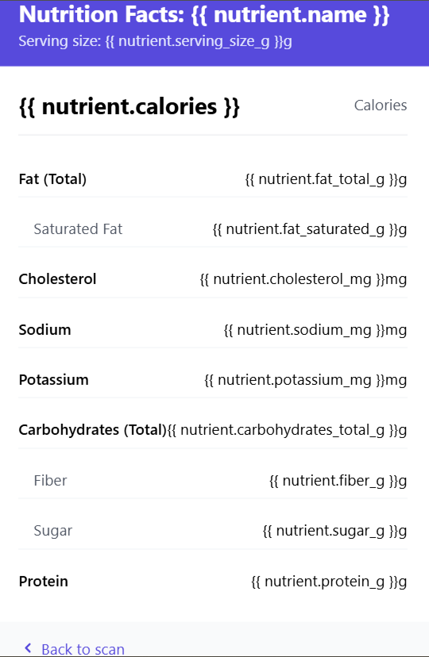

# 🍽️ SnapCal

[](https://opensource.org/licenses/MIT)
[](https://www.python.org/downloads/)
[](https://www.tensorflow.org/)
[](https://flask.palletsprojects.com/)

> Snap a photo of your food, get instant calorie estimates and nutritional information

## 📖 Table of Contentsd

- [Overview](#overview)
- [Features](#features)
- [Technologies](#technologies)
- [Installation](#installation)
- [Usage](#usage)
- [Model Training](#model-training)
- [API Integration](#api-integration)
- [Future Enhancements](#future-enhancements)
- [Contributing](#contributing)
- [License](#license)

## 🔍 Overview

SnapCal is a web application that uses machine learning to identify food items from uploaded images and provides detailed nutritional information including calorie content. Simply take a photo of your meal, upload it, and the app will determine what food it is and display its nutritional profile.

## ✨ Features

- **Food Recognition**: Uses a deep learning model trained on the Food-101 dataset to identify food items from images
- **User Authentication**: Secure login, registration, and password recovery
- **Nutritional Information**: Provides comprehensive nutritional data for identified foods
- **Weight Customization**: Adjust portion size to get accurate nutritional estimates
- **Responsive Design**: Works on desktop and mobile devices
- **Top Predictions**: Shows multiple potential food matches with confidence scores

## 🛠️ Technologies

- **Backend**: Flask (Python)
- **Authentication**: Firebase Authentication
- **Machine Learning**: TensorFlow, MobileNetV2 (transfer learning)
- **Dataset**: Food-101 (101 food categories with 101,000 images)
- **API**: Nutrition API by API Ninjas
- **Frontend**: HTML, CSS, JavaScript

## 🚀 Installation

1. Clone the repository:
   ```bash
   git clone https://github.com/parth0774/SnapCal.git
   cd snapcal
   ```

2. Create and activate a virtual environment:
   ```bash
   python -m venv venv
   source venv/bin/activate  # On Windows: venv\Scripts\activate
   ```

3. Install dependencies:
   ```bash
   pip install -r requirements.txt
   ```

4. Configure Firebase:
   - Create a Firebase project at [Firebase Console](https://console.firebase.google.com/)
   - Enable Email/Password authentication
   - Add your Firebase configuration to `app.py`

5. Set up API key:
   - Register for an API key at [API Ninjas](https://api-ninjas.com/)
   - Add your API key to the `NutrientAPI` class in `app.py`

## 💻 Usage

1. Start the Flask server:
   ```bash
   python app.py
   ```

2. Open your browser and navigate to:
   ```
   http://localhost:8080
   ```

3. Create an account or log in

4. Upload a food image

5. Review the predictions and select the correct food item

6. Adjust the portion weight if needed

7. View the detailed nutritional information

## 🧠 Model Training

The food recognition model was built using transfer learning with MobileNetV2 as the base architecture. It was trained on the Food-101 dataset containing 101,000 images across 101 food categories.

Food101-Dataset [[Click Here](https://www.kaggle.com/datasets/dansbecker/food-101)]

### Training Process:

1. Data preparation and augmentation
2. Transfer learning from MobileNetV2 pre-trained on ImageNet
3. Fine-tuning with regularization to prevent overfitting
4. Validation and testing to ensure accuracy

Training configuration:
- Image size: 299×299 pixels
- Batch size: 20
- Optimizer: SGD with momentum (0.9)
- Learning rate: 0.0001
- Epochs: 10

## 🔌 API Integration

SnapCal integrates with the Nutrition API by API Ninjas to fetch detailed nutritional information. The API provides data on:

- Calories
- Protein
- Carbohydrates
- Fat (total, saturated, unsaturated)
- Fiber
- Sugar
- Sodium
- Potassium
- Cholesterol
- Vitamins and minerals

## 📸 Screenshots

<p align="center">
  <em>Login Screen</em>
  
</p>

<p align="center">
  <em>Prediction Results and Nutriton Information</em>
  
</p>

## 🚀 Future Enhancements

- User history and meal tracking
- Daily nutritional summaries
- Meal recommendations based on dietary goals
- Barcode scanning for packaged foods
- Multi-item recognition for complete meal analysis
- Mobile app development
- Offline functionality

## 👥 Contributing

Contributions are welcome! Please feel free to submit a Pull Request.

1. Fork the repository
2. Create your feature branch
3. Commit your changes 
4. Push to the branch 
5. Open a Pull Request

<p align="center">
  Made By Parth Patel
</p>
